# Springfield Plugin

[](https://github.com/bradleygolden/springfield)
[](LICENSE)
[]()

## Table of Contents

- [What is this?](#what-is-this)
- [Installation](#installation)
- [Usage](#usage)
- [How it Works](#how-it-works)
- [Requirements](#requirements)
- [Monitoring Sessions](#monitoring-sessions)
- [Safety Warning](#safety-warning)
- [Philosophy](#philosophy)
- [Sources of Inspiration](#sources-of-inspiration)
- [Disclaimers](#disclaimers)
- [License](#license)

*"I'm learnding!"* - Ralph Wiggum

Autonomous workflow orchestration for Claude Code, where cartoon characters do your coding. It's like having the whole town of Springfield working on your project!

## What is this?

Springfield is a Claude Code plugin that breaks down complex tasks into phases, each handled by a different Simpsons character:

- **Lisa** 📚 - Does the research (she's the smart one)
- **Mayor Quimby** 🎩 - Decides if it's simple or complex (he's good at delegating)
- **Professor Frink** 🔬 - Makes the plan (with the science and the planning, glavin!)
- **Principal Skinner** 📋 - Reviews complex plans (pathetic work, Professor!)
- **Ralph** 🖍️ - Implements through persistent iteration (I'm learnding!)
- **Comic Book Guy** 💬 - Reviews the quality ("Worst code ever... or best?")

## Installation

From GitHub:

```bash
claude
/plugin marketplace add bradleygolden/springfield
/plugin install springfield@springfield
```

## Usage

Just tell Springfield what to do:

```bash
"springfield help me add user authentication to the API"
```

Springfield runs all phases automatically. Or run them individually:

```bash
/springfield:lisa "authentication"     # Research
/springfield:mayor-quimby              # Decide complexity
/springfield:frink                     # Plan
/springfield:skinner                   # Review plan (COMPLEX tasks only)
/springfield:ralph                     # Implement
/springfield:comic-book-guy            # Review
/springfield:watch                     # Monitor progress
```

### Advanced Flags

```bash
/springfield:lisa "task" --dry-run                 # Create session without executing
/springfield:lisa --session=SESSION_ID             # Resume specific session
/springfield:lisa --research-file=research.md      # Use existing research
/springfield:frink --plan-file=prompt.md           # Use existing plan
/springfield:frink --force                         # Skip Skinner review
/springfield:ralph --session=SESSION_ID            # Resume Ralph implementation
/springfield:watch SESSION_ID --interval=30        # Watch with custom interval
/springfield:watch --quiet                         # Minimal output
```

## How it Works

Springfield creates a `.springfield/` directory with session folders for each task (format: `MM-DD-YYYY-task-name/`). Inside you'll find:

- `state.json` - Structured session state with schema versioning
- `chat.md` - Interactive communication with characters
- `research.md` - Lisa's findings
- `decision.txt` - SIMPLE or COMPLEX
- `plan-v1.md` - Frink's initial plan (COMPLEX tasks)
- `review.md` - Skinner's plan feedback (COMPLEX tasks)
- `prompt.md` - Final implementation plan with subtasks
- `scratchpad.md` - Ralph's progress notes (updated every iteration)
- `completion.md` - "Task complete!" signal
- `qa-report.md` - Comic Book Guy's verdict

### State Management

Springfield uses structured state tracking via `state.json`:

```json
{
  "schema_version": "1.0",
  "session_id": "11-05-2025-task-name",
  "status": "in_progress",
  "current_phase": "ralph",
  "iteration_count": 42,
  "phases": {
    "lisa": { "status": "complete", "start_time": "...", "end_time": "..." },
    "ralph": { "status": "in_progress", "iteration": 42 }
  },
  "subtasks": [
    { "id": 1, "description": "...", "status": "COMPLETE", "failures": 0 }
  ],
  "transitions": [...],
  "kickbacks": [...],
  "kickback_counts": { "lisa": 0, "frink": 0, "ralph": 1 }
}
```

Use `jq` to query session state: `jq '.status' .springfield/*/state.json`

### Chat Interface

Talk to characters during execution via `chat.md`:

```markdown
**[2025-11-05 14:30:00] RALPH:**
I'm working on subtask 3! I'm learnding!

User: @ralph please add tests for auth.js

**[2025-11-05 14:32:00] RALPH:**
I'm adding tests! (re: your message about auth.js)
That's where I'm a Viking!
```

Characters check chat.md at phase start and respond if @mentioned (or if no mentions). Ralph checks every 3 iterations.

### Failure Thresholds

Ralph implements with safety limits:

- **n_fails = 3**: Max failures per subtask before marking FAILED
- **n_rounds = 500**: Max total iterations before session fails with partial completion

If Ralph hits n_rounds limit, session exits with code 1 and partial completion report in scratchpad.md.

### Kickback Routing

Comic Book Guy routes issues back to appropriate characters:

- **RESEARCH_GAP** → Lisa (missing context)
- **DESIGN_ISSUE** → Frink (architecture problems)
- **IMPLEMENTATION_BUG** → Ralph (code bugs)

**Kickback limits**: Max 2 kickbacks per character. After 2, Comic Book Guy escalates to user via chat.md.

For complex tasks, Professor Frink runs a debate loop where two AI perspectives argue until they reach consensus on the best approach. If task is COMPLEX, Skinner reviews Frink's plan before Ralph implements.

### Workflow Diagram

```mermaid
%%{init: {'theme':'dark','themeVariables': {'darkMode':'true','edgeLabelBackground':'#1e1e1e','labelColor':'#ffffff'}}}%%
graph TD
    Start([User Task]) --> Lisa[📚 Lisa: Research]
    Lisa --> |research.md| Quimby{🎩 Mayor Quimby: Decide}

    Quimby --> |SIMPLE| FrinkSimple[🔬 Frink: Simple Plan]
    Quimby --> |COMPLEX| FrinkComplex[🔬 Frink: Debate Loop]

    FrinkComplex --> |Proposer vs Counter| Consensus{Agents Agree?}
    Consensus --> |No| FrinkComplex
    Consensus --> |Yes| FrinkDone[📝 prompt.md]

    FrinkSimple --> |prompt.md| Ralph[🖍️ Ralph: Implement Loop]
    FrinkDone --> Ralph

    Ralph --> |completion.md| ComicBook[💬 Comic Book Guy: QA]

    ComicBook --> QAResult{Quality Check}
    QAResult --> |Issues Found| Kickback{What's Wrong?}
    QAResult --> |Approved| Done([✅ Task Complete])

    Kickback --> |Research Gap| Lisa
    Kickback --> |Design Issue| FrinkSimple
    Kickback --> |Implementation Bug| Ralph

    style Lisa fill:#FFE4B5,stroke:#333,color:#000
    style Quimby fill:#D8BFD8,stroke:#333,color:#000
    style FrinkSimple fill:#B0E0E6,stroke:#333,color:#000
    style FrinkComplex fill:#B0E0E6,stroke:#333,color:#000
    style Ralph fill:#FFB6C1,stroke:#333,color:#000
    style ComicBook fill:#98FB98,stroke:#333,color:#000
    style Done fill:#90EE90,stroke:#333,color:#000

    linkStyle default stroke:#fff,stroke-width:2px
```



## Requirements

- Claude Code CLI
- Node.js (for `npx` and `repomirror`)
- Bash 4.0+
- Standard Unix tools (mktemp, readlink/realpath)
- **jq** (for state.json operations) - Install: `brew install jq` (macOS) or `apt-get install jq` (Linux)

Springfield validates jq availability at session start. Without jq, state.json features are unavailable.

## Monitoring Sessions

Use the watch command to monitor Ralph's progress in real-time:

```bash
/springfield:watch                    # Watch most recent session
/springfield:watch SESSION_ID         # Watch specific session
/springfield:watch --interval=30      # Custom check interval (seconds)
/springfield:watch --quiet            # Minimal output
```

Example output:
```
=== Springfield Session Monitor ===
Session: 11-05-2025-add-authentication
Status: in_progress
Phase: ralph

[14:32:15] Ralph (Iteration 42/500)
  └─ Subtask 3/5: Update character commands **[IN_PROGRESS]**
  └─ Failures: 1/3
  └─ Recent: "I'm adding state.json tracking! I'm helping!"
```

### Exit Codes

Springfield commands use standardized exit codes for automation:

- **0**: Session completed successfully
- **1**: Session failed (n_rounds exceeded or unrecoverable error)
- **2**: User cancelled (Ctrl+C)
- **3**: State corruption detected (invalid JSON)

Use in scripts:
```bash
/springfield:watch --quiet
if [ $? -eq 0 ]; then
  echo "Success! Deploy to production"
elif [ $? -eq 1 ]; then
  echo "Failed - check logs"
fi
```

## Safety Warning

**Use at your own risk!** This plugin uses `--dangerously-skip-permissions` and executes commands autonomously. Run it in a sandboxed environment or on projects you don't mind experimenting with. Think of it like letting Ralph learn unsupervised - entertaining, but maybe not in production.

## Philosophy

Based on the [Ralph pattern](https://ghuntley.com/ralph/) - eventual consistency through iterative refinement. Ralph might not be the smartest, but he gets there eventually through small, persistent steps.

See `skills/springfield/REFERENCE.md` for the full philosophy.

## Sources of Inspiration

- [Ralph pattern by Geoffrey Huntley](https://ghuntley.com/ralph/)
- [The Denario Project: Deep knowledge AI agents for scientific discovery (arXiv:2510.26887)](https://arxiv.org/abs/2510.26887)
- [HumanLayer Claude Commands](https://github.com/humanlayer/humanlayer/tree/main/.claude/commands)

## Disclaimers

This project uses character names from The Simpsons™ for thematic purposes only. The Simpsons™ is a trademark of 20th Television and Disney. This project is not affiliated with, endorsed by, or connected to The Simpsons, Disney, or 20th Television.

The code works about as well as Springfield's nuclear power plant - it'll get the job done, but don't be surprised if there's the occasional meltdown.

## License

MIT

## Author

Bradley Golden

*"Hi, Super Nintendo Chalmers!"*
